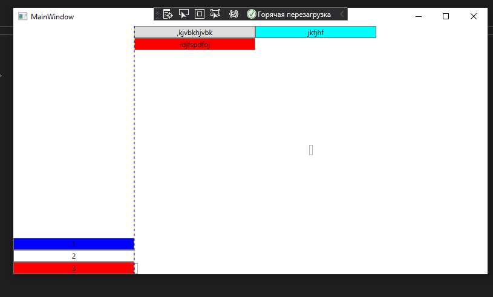

<table style="width: 100%;">
  <tr>
    <td style="text-align: center; border: none;">
    Министерство образования и науки РФ<br>
Государственное бюджетное профессиональное образовательное учреждение Республики Марий Эл<br>
Йошкар-Олинский технологический колледж
</td>
  </tr>
  <tr>
    <td style="text-align: center; border: none; height: 15em;">
    <h2 style="font-size:3em;">Отчет</h2>
      <h3>по лабораторной работе<br><br> по дисциплине "Основы алгоритмизации и программирования"<br><br> Тема:<b>"Создание WPF-приложения. Знакомство с компоновкой."<b> </h3></td>
  </tr>
  <tr>
    <br><br><td style="text-align: right; border: none; height: 20em;">
      Разработал:<br/>
      Кропотова Юлия<br>
      Группа: И-21<br>
      Преподаватель:<br>
      Колесников Евгений Иванович
    </td>
  </tr>
  <tr>
    <td style="text-align: center; border: none; height: 5em;">
    г.Йошкар-Ола, 2021</td>
  </tr>
</table>

<div style="page-break-after: always;"></div>

# Цели и задачи:
 1. Создать приложение WPF .NET Framework
 2. Исследовать контейнеры


# Краткий материал.


1. Grid - Это наиболее мощный и часто используемый контейнер, напоминающий обычную таблицу. Он содержит столбцы и/или строки, количество которых задает разработчик. Для определения строк используется свойство RowDefinitions, а для определения столбцов - свойство ColumnDefinitions:

2. Чтобы задать позицию элемента управления с привязкой к определенной ячейке Grid-а, в разметке элемента нужно прописать значения свойств Grid.Column и Grid.Row, тем самым указывая, в каком столбце и строке будет находиться элемент. Кроме того, если мы хотим растянуть элемент управления на несколько строк или столбцов, то можно указать свойства Grid.ColumnSpan и Grid.RowSpan, как в следующем примере:

    ```


```xml
<Grid ShowGridLines="True">
        <Grid.RowDefinitions>
            <RowDefinition Height="auto"></RowDefinition>
            <RowDefinition Height="*"></RowDefinition>
            <RowDefinition Height="2*"></RowDefinition>
        </Grid.RowDefinitions>
        <Grid.ColumnDefinitions>
            <ColumnDefinition Width="200"></ColumnDefinition>
            <ColumnDefinition></ColumnDefinition>
            <ColumnDefinition></ColumnDefinition>
        </Grid.ColumnDefinitions>
        <TextBox 
            Grid.Column="0" 
            Grid.Row="0" 
            Text="Строка с автоматичекой высотой"/>
        <TextBox 
            Grid.Column="0" 
            Grid.Row="1"  
            Grid.ColumnSpan="3" 
            Text="Колонна с фиксированной шириной"
            VerticalAlignment="Bottom"
            HorizontalAlignment="Left"/>
        <TextBox
            Grid.Column="2" 
            Grid.Row="2"
            Text="Строка с весовым коэффициентом 2"
            VerticalAlignment="Center"
            HorizontalAlignment="Center"/>
        
</Grid>
```


```xml
        <StackPanel 
            Grid.Column="0" 
            Grid.RowSpan="3"
            VerticalAlignment="Bottom"
            Grid.Row="0" >
            <Button Background="Blue" Content="1" />
            <Button Background="White" Content="2" />
            <Button Background="Red" Content="3" />
        </StackPanel>
        <TextBox 
            Grid.Column="1" 
            Grid.Row="1"  
            Grid.ColumnSpan="2" 
            VerticalAlignment="Bottom"
            HorizontalAlignment="Left"/>
        <TextBox
            Grid.Column="2" 
            Grid.Row="2"
            VerticalAlignment="Center"
            HorizontalAlignment="Center"/>
        <Grid Grid.Column="1">
            <Grid.RowDefinitions>
                <RowDefinition Height="auto"></RowDefinition>
                <RowDefinition></RowDefinition>
            </Grid.RowDefinitions>
            <WrapPanel ItemWidth="200">
                <Button>
                    ,kjvbkhjvbk
                </Button>
                <Button Content="jkfjhf" Background="Aqua"/>
                <Button Content="idjfspdfoj" Background="Red"/>
            </WrapPanel>
```

# Вывод

Мы научились работать и создавать WPF-приложения и компоновкой, создавать приложение WPF .NET Framework, исследовали контейнеры
А так же Grid, StackPanel, WrapPanel